<h1>⚽ 선호 팀 기반 풋살 매칭 서비스 Run On Ground</h1>
 

<h2>프로젝트 소개</h2>

  <ui>
    <li>Run On Ground는 특정 팀을 좋아하는 사람들이 해당 팀을 응원하고, 선수가 되어 풋살 경기를 매칭하는 서비스입니다.</li>
    <li>회원가입시에 선호 팀을 선정해 해당 팀만 접근 가능한 페이지로 이동합니다.</li>
    <li>팀별로 커뮤니티 이용, 풋살 팀원 모집을 할 수 있습니다.</li>
    <li>팀원이 모집되면 모든 팀이 이용할 수 있는 매칭 게시판에 경기를 등록하거나, 등록된 경기에 참가 신청을 할 수 있습니다.</li>
  </ui>

 

<h2>팀원 구성</h2>
<table>
  <thead>
    <tr>
      <th>김범규</th>
      <th>김태성</th>
    </tr>
  </thead>
  <tbody>
    <tr>
      <td></td>
      <td style: width=200px;></td>
    </tr>
  </tbody>
</table>
 

<h2>1. 개발 환경</h2>

  <ui>
    <li>Front : Vue.js, javascript</li>
    <li>Back : SpringBoot, Mybatis</li>
    <li>협업 툴 : Discord, Git</li>
  </ui>

 

<h2>2. 역할 분담</h2>

  <h3>😊김범규</h3>
  <h4>Front</h4>
    <ui>
      <li>회원가입, 로그인, 로그아웃 구현</li>
      <li>사용자의 선호 팀에 맞는 커뮤니티 구현</li>
      <li>전체적인 웹페이지 디자인</li>
    </ui>
  <h4>Back</h4>
    <ui>
      <li>파일 입출력 구현</li>
      <li>팀원 등록, 삭제 구현</li>
    </ui>

 

<h3>😎김태성</h3>
<h4>Front</h4>
  <ui>
    <li>같은 팀 팀원 모집 구현</li>
    <li>팀 간 매칭 게시판 구현</li>
    <li>매칭 글 등록, 수정, 삭제 구현</li>
    <li>GPT, Youtube API 연동</li>
  </ui>
<h4>Back</h4>
  <ui>
    <li>회원가입, 로그인, 로그아웃 구현</li>
    <li>사용자의 닉네임과 선호 팀을 세션에 등록해 사용자에 맞는 동적인 페이지 구현</li>
    <li>같은 팀 모집 글 등록 시, 새로운 팀 생성 구현</li>
  </ui>  

 

<h2>3. 개발 기간</h2>

  <ui>
    <li>전체 개발 기간 : 2024-05-16 ~ 2024-05-23</li>
    <li>요구사항 분석 및 설계 : 2024-05-16 ~ 2024-05-16</li>
    <li>DB, Back : 2024-05-17 ~ 2024-05-20</li>
    <li>Front : 2024-05-20 ~ 2024-05-23</li>
  </ui>

 

<h2>4. 페이지 별 기능</h2>

  <h3>[초기화면]</h3>
  

    <ui>
      <li>사용자의 선호 팀에 따른 커뮤니티를 동적으로 보여주기 위해 로그인 페이지가 먼저 나타납니다.</li>
    </ui>
  

   
  

    <table>
      <tr>
        <th>로그인</th>
      </tr>
      <tr>
        <td></td>
      </tr>
    </table>
  

 

  <h3>[회원가입]</h3>
  

    <ui>
      <li>회원가입 시에 사용자가 선호하는 팀을 선택해야 회원가입이 가능합니다.</li>
      <li>많은 팀을 선택하지 못하고, 6개의 팀만 선택할 수 있게 구현했습니다.</li>
    </ui>
  

   
  

    <table>
      <tr>
        <th>회원가입</th>
      </tr>
      <tr>
        <td>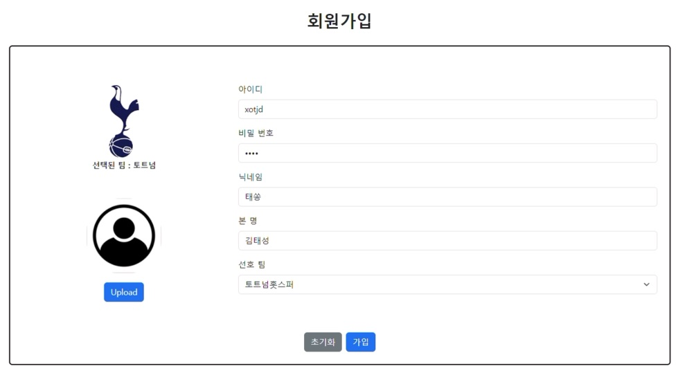</td>
      </tr>
    </table>
  

 

  <h3>[로그인 후 메인 화면]</h3>
  

    <ui>
      <li>6개의 팀 별로 동적으로 바뀌는 메인 화면과 커뮤니티를 구현했습니다.</li>
    </ui>
  

   
  

    <table>
      <thead>
        <tr>
          <th>토트넘</th>
          <th>아스날</th>
        </tr>
      </thead>
      <tbody>
        <tr>
          <td>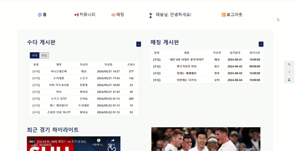</td>
          <td>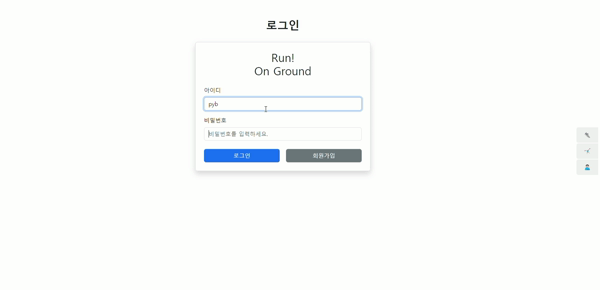</td>
        </tr>
      </tbody>
    </table>
  

  

    <table>
      <thead>
        <tr>
          <th>맨시티</th>
          <th>맨유</th>
        </tr>
      </thead>
      <tbody>
        <tr>
          <td>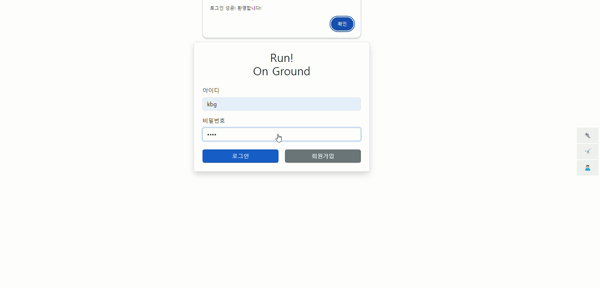</td>
          <td>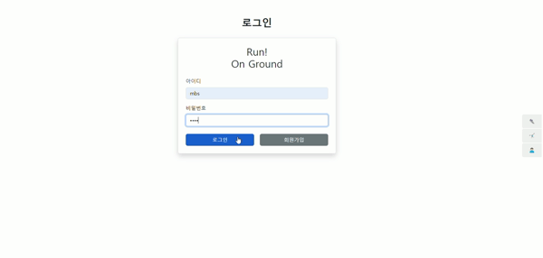</td>
        </tr>
      </tbody>
    </table>
  

  

    <table>
      <thead>
        <tr>
          <th>리버풀</th>
          <th>첼시</th>
        </tr>
      </thead>
      <tbody>
        <tr>
          <td>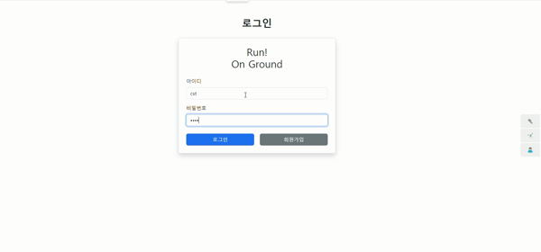</td>
          <td>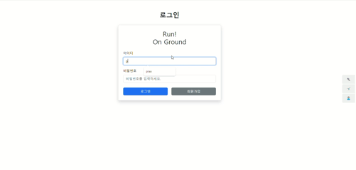</td>
        </tr>
      </tbody>
    </table>
  

 

  <h3>[팀 별 게시판]</h3>
  <ui>
    <li>로그인 한 유저의 선호 팀에 맞게 게시판을 볼 수 있습니다.</li>
    <li>게시판에는 선호 팀에 관한 수다 게시판과 풋살 팀원을 모집하는 모집 게시판이 있습니다.</li>
  </ui>

  <h4>1) 수다 게시판</h4>
  <ui>
    <li>수다 게시판에선 글과 사진 등록이 가능하고, 수정과 삭제도 가능합니다.</li>
    <li>게시물에 댓글 등록, 수정, 삭제가 가능합니다.</li>
    <li>본인이 등록한 글에 추천을 누를 수 있고, 다른 사용자가 올린 글에도 추천이 가능합니다.</li>
  </ui>
   

  

    <table>
      <tr>
        <th>게시판 리스트</th>
        <th>등록된 게시글</th>
      </tr>
      <tr>
        <td>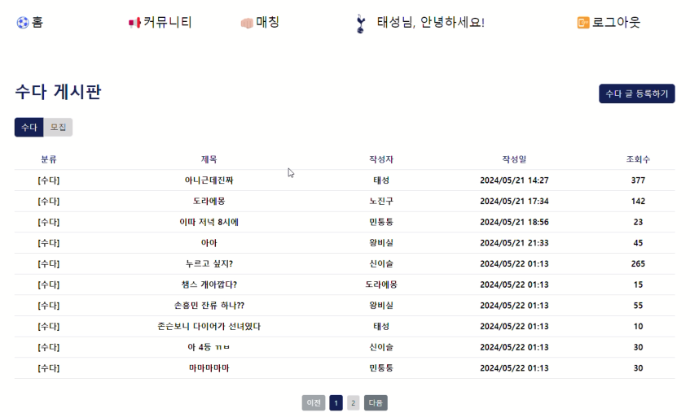</td>
        <td>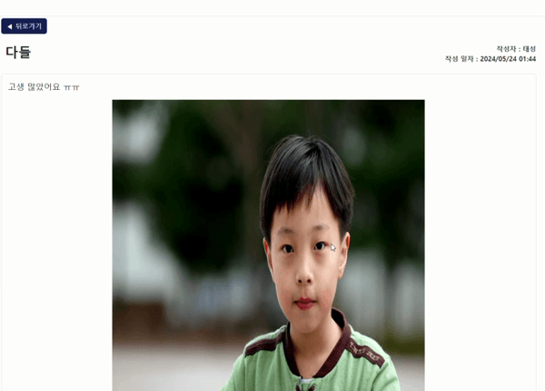</td>
      </tr>
    </table>
    <table>
      <tr>
        <th>댓글</th>
        <th>추천</th>
      </tr>
      <tr>
        <td>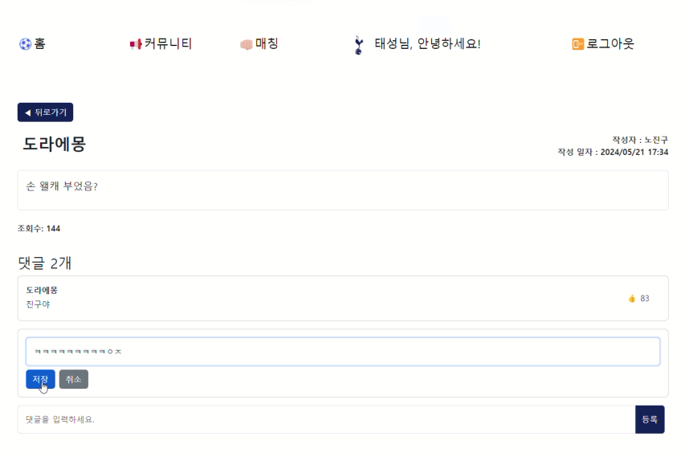</td>
        <td>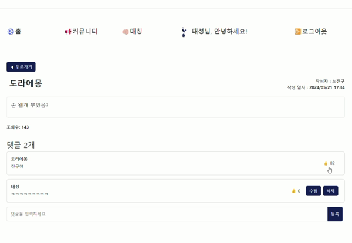</td>
      </tr>
    </table>
  

 

  

    <h4>2) 모집 게시판</h4>
    <ui>
      <li>모집 게시판에서는 같은 팀을 응원하는 사용자들이 하나의 풋살 팀을 꾸릴 수 있습니다.</li>
      <li>모집 글을 올린 사용자가 팀의 리더로 등록되고, 모집 글을 등록하면 하나의 팀이 생성됩니다.</li>
      <li>다른 사용자들이 모집 글을 보고 팀원으로 등록과 취소가 가능합니다.</li>
    </ui>
  

   
  
  

    <table>
      <tr>
        <th>팀원 모집 글 등록</th>
        <th>팀원으로 등록 & 취소</th>
      </tr>
      <tr>
        <td>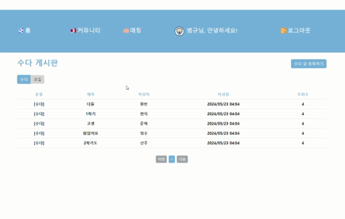</td>
        <td>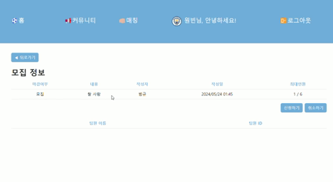</td>
      </tr>
    </table>
  

 

  

    <h3>[매칭 게시판]</h3>
    <ui>
      <li>선호 팀에 상관 없이 모든 사용자가 이용 가능한 매칭 게시판입니다.</li>
      <li>팀원을 모아온 리더가 모집 글을 새롭게 등록하거나 등록 된 글을 보고 매칭 신청과 취소가 가능합니다.</li>
      <li>매칭 글 등록 시에 매칭 내용, 시간, 날짜, 경기장을 선택하게 됩니다.</li>
      <li>기존의 매칭 글에 신청하면 동적으로 리더의 팀원이 화면에 나타나게 됩니다.</li>
    </ui>
  

   
  

    <table>
      <tr>
        <th>매칭 내용 & 시간 & 날짜 선택</th>
        <th>경기장 선택</th>
      </tr>
      <tr>
        <td>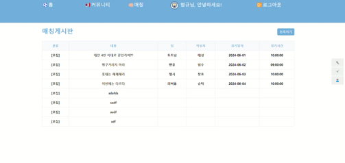</td>
        <td></td>
      </tr>
    </table>
    <table>
      <tr>
        <th>기존의 매칭 글에 경기 신청</th>
      </tr>
      <tr>
        <td>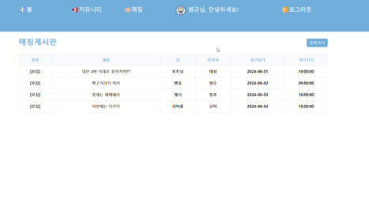</td>
      </tr>
    </table>
  

 

  <h3>[ChatGPT-API]</h3>
  

    <ui>
      <li>ChatGPT-API를 이용해 서비스 사용자들에게 여러 정보를 제공하였습니다.</li>
      <li>👟 버튼을 클릭하면 사용자가 사용할만한 풋살화를 추천해줍니다.</li>
      <li>🤸‍♂️ 버튼을 클릭하면 풋살 경기 전에 할 스트레칭을 추천해줍니다.</li>
      <li>🙅🏻‍♂️ 버튼을 클릭하면 풋살 경기 중의 에티켓에 대해 알려줍니다.</li>
    </ui>
  

   
  

    <table>
      <tr>
        <th>👟 버튼</th>
        <th>🤸‍♂️ 버튼</th>
        <th>🙅🏻‍♂️ 버튼</th>
      </tr>
      <tr>
        <td></td>
        <td></td>
        <td></td>
      </tr>
    </table>
  

 

  <h3>[Youtube-API]</h3>
  

    <ui>
      <li>사용자의 선호 팀 별 최근 경기 하이라이트를 보여줍니다.</li>
      <li>응원 팀의 경기를 따로 찾아보는 수고 없이 사용자에게 제공합니다.</li>
    </ui>
  

   
  

    <table>
      <tr>
        <th>토트넘</th>
        <th>맨시티</th>
      </tr>
      <tr>
        <td>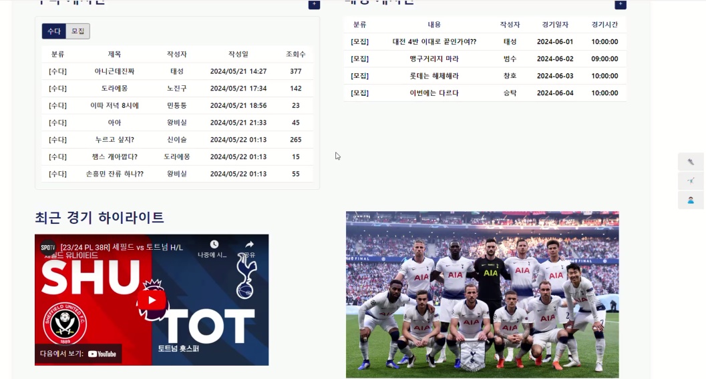</td>
        <td>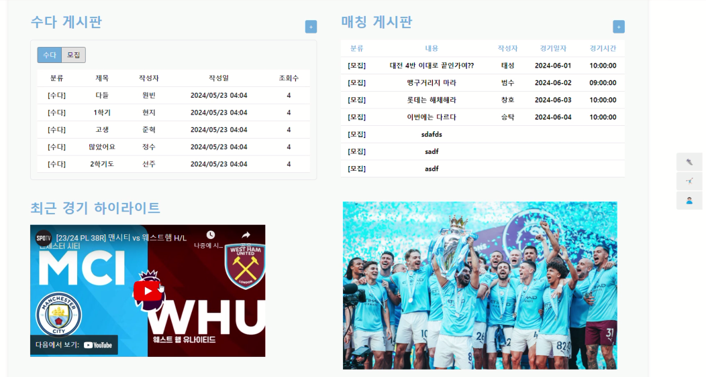</td>
      </tr>
    </table>
  

 

<h2>5. 아쉬운 점</h2>

  <ui>
    <li>사용자 별 마이페이지를 만들어 개인 정보를 확인하지 못해 아쉬웠습니다.</li>
    <li>팀의 리더만 매칭 게시판에서 경기를 등록하고, 신청했어야 하는데 그 점은 구현하지 못해 아쉬웠습니다.</li>
  </ui>

 

<h2>6. 프로젝트 후기</h2>
<h3>😊김범규</h3>
하나의 웹 서비스를 만들면서, 처음에 구상했던 대로 될 줄 알았던 생각과는 다르게 계속적으로 수정사항이 나와 힘들었던 기억이 있습니다. 다음에 프로젝트를 진행할 때는 요구사항과 설계를 확실하게 해야겠다는 생각이 들었습니다.
 

<h3>😎김태성</h3>
개발을 시작하기 전에 팀원과 끊임없이 초기 구성에 대해 이야기 하며 개발해야 할 기능, 구성 등을 확실하게 정해야겠다는 생각이들었고, 목업도 세세하게 잘 구현해놓고 그에 맞게 화면 설계를 해야겠다고 느꼈습니다. 추가로 다음 프로젝트를 진행할 때는 오류로 인해 어려웠던 점을 따로 기록해두고 그 점을 어떻게 해쳐나갔는지도 기록으로 남겨보려고 합니다!
