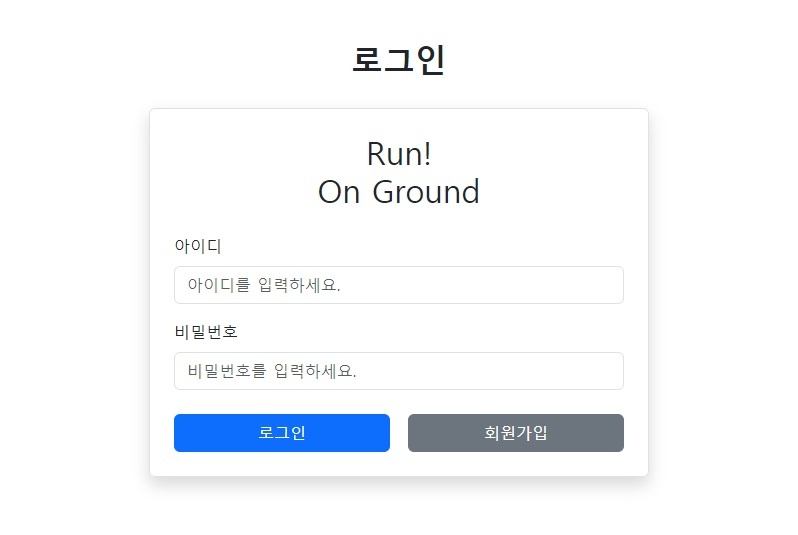
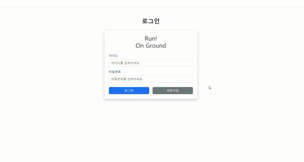

<h1>⚽ 선호 팀 기반 풋살 매칭 서비스 Run On Ground</h1>
 

<h2>프로젝트 소개</h2>

  <ui>
    <li>Run On Ground는 특정 팀을 좋아하는 사람들이 해당 팀을 응원하고, 선수가 되어 풋살 경기를 매칭하는 서비스입니다.</li>
    <li>회원가입시에 선호 팀을 선정해 해당 팀만 접근 가능한 페이지로 이동합니다.</li>
    <li>팀별로 커뮤니티 이용, 풋살 팀원 모집을 할 수 있습니다.</li>
    <li>팀원이 모집되면 모든 팀이 이용할 수 있는 매칭 게시판에 경기를 등록하거나, 등록된 경기에 참가 신청을 할 수 있습니다.</li>
  </ui>

 

<h2>팀원 구성</h2>
<table>
  <thead>
    <tr>
      <th>김범규</th>
      <th>김태성</th>
    </tr>
  </thead>
  <tbody>
    <tr>
      <td></td>
      <td style: width=200px;></td>
    </tr>
  </tbody>
</table>
 

<h2>1. 개발 환경</h2>

  <ui>
    <li>Front : Vue.js, javascript</li>
    <li>Back : SpringBoot, Mybatis</li>
    <li>협업 툴 : Discord, Git</li>
  </ui>

 

<h2>2. 역할 분담</h2>

  <h3>😊김범규</h3>
  <h4>Front</h4>
    <ui>
      <li>회원가입, 로그인, 로그아웃 구현</li>
      <li>사용자의 선호 팀에 맞는 커뮤니티 구현</li>
      <li>전체적인 웹페이지 디자인</li>
    </ui>
  <h4>Back</h4>
    <ui>
      <li>파일 입출력 구현</li>
      <li>팀원 등록, 삭제 구현</li>
    </ui>

 

<h3>😎김태성</h3>
<h4>Front</h4>
  <ui>
    <li>같은 팀 팀원 모집 구현</li>
    <li>팀 간 매칭 게시판 구현</li>
    <li>매칭 글 등록, 수정, 삭제 구현</li>
    <li>GPT, Youtube API 연동</li>
  </ui>
<h4>Back</h4>
  <ui>
    <li>회원가입, 로그인, 로그아웃 구현</li>
    <li>사용자의 닉네임과 선호 팀을 세션에 등록해 사용자에 맞는 동적인 페이지 구현</li>
    <li>같은 팀 모집 글 등록 시, 새로운 팀 생성 구현</li>
  </ui>  

 

<h2>3. 개발 기간</h2>

  <ui>
    <li>전체 개발 기간 : 2024-05-16 ~ 2024-05-23</li>
    <li>요구사항 분석 및 설계 : 2024-05-16 ~ 2024-05-16</li>
    <li>DB, Back : 2024-05-17 ~ 2024-05-20</li>
    <li>Front : 2024-05-20 ~ 2024-05-23</li>
  </ui>

 

<h2>4. 페이지 별 기능</h2>

  <h3>[초기화면]</h3>
    <ui>
      <li>사용자의 선호팀에 따른 커뮤니티를 보여주기 위해 로그인 페이지가 나타납니다.</li>
    </ui>
  
  

